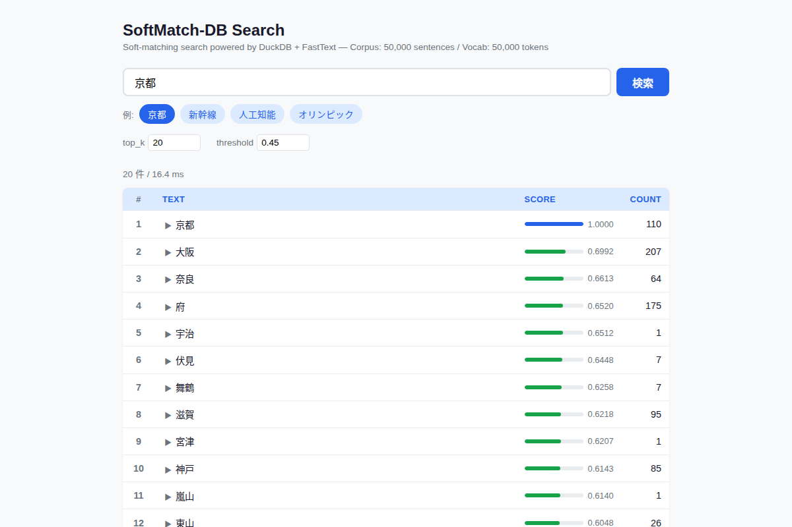
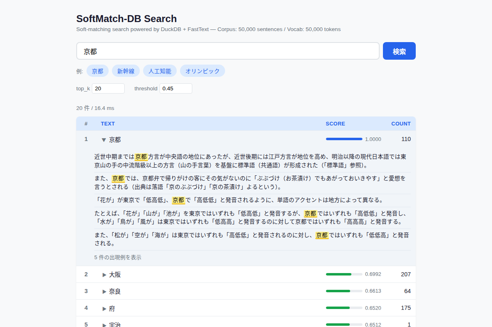
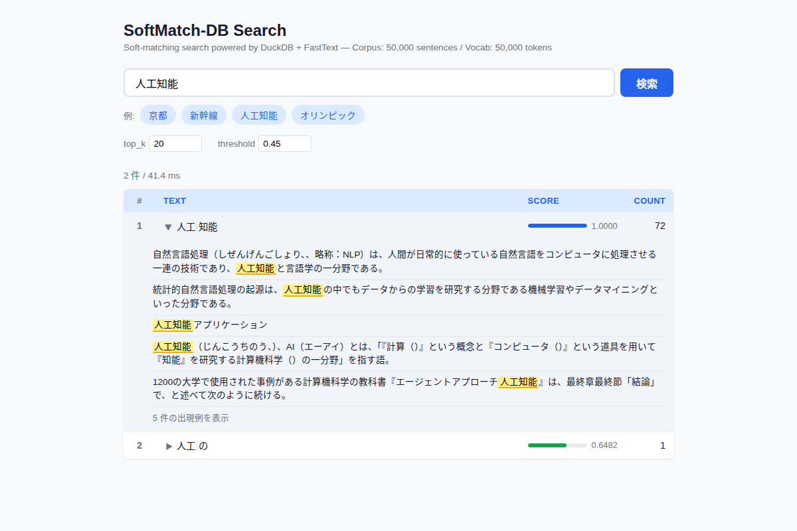

# SoftMatch-DB

**SoftMatcha2 アルゴリズムの Pure Python 再実装 + DuckDB インデックス + Web 検索 UI**

[SoftMatcha2](https://github.com/softmatcha/softmatcha2)（Rust 実装）のコアアルゴリズムを Python/NumPy で再現し、DuckDB をストレージバックエンドとして統合した検索エンジンです。

## What is SoftMatcha2?

SoftMatcha2 は、テキストコーパス中から**意味的に類似するパターン**を高速に検索するアルゴリズムです。単語の完全一致ではなく、FastText 埋め込みによるコサイン類似度を用いた「ソフトマッチング」を行います。

例: `京都` で検索 → `京都`(1.00), `大阪`(0.70), `奈良`(0.66) のような意味的に関連するパターンがヒット

## Screenshots

### 検索結果（「京都」）
意味的に類似する地名がスコア付きで一覧表示されます。スコアバーは青(0.8+)/緑(0.6+)/黄(0.45+) の色段階。



### KWIC 出現例（クリックで展開）
結果行をクリックすると、コーパス中の出現例がハイライト付きで表示されます。



### マルチトークン検索（「人工知能」→「人工|知能」）
複合語は MeCab で分割され、マルチトークンのソフトマッチングが実行されます。



## Features

- **公式アルゴリズムの忠実な再現**: cand_next 先読み + n-gram フィルタ + sorted index の3層フィルタリング
- **DuckDB 統合**: コーパス・語彙・インデックスを単一の `.duckdb` ファイルに格納
- **Web 検索 UI**: FastAPI + vanilla JS によるブラウザベースの検索インターフェース
  - KWIC（Keyword-In-Context）出現例表示
  - スコアバー色段階表示
  - トークン分割の可視化
- **MeCab トークナイザ**: 公式 SoftMatcha2 と同一のトークナイズ方式（FastText との語彙一致率を最大化）
- **80 テスト**: unit 64 + benchmark 16

## Architecture

```
┌─────────────────────────────────────────────────┐
│  Web UI (index.html)                            │
│  ├── /api/search → soft-matching search         │
│  ├── /api/kwic   → corpus example lookup        │
│  └── /api/stats  → dataset statistics           │
├─────────────────────────────────────────────────┤
│  FastAPI (app.py)                               │
├─────────────────────────────────────────────────┤
│  softmatch_db Python API                        │
│  ├── register(con) / build(con, ...) / search() │
│  └── Searcher (in-memory, no SQL at query time) │
├─────────────────────────────────────────────────┤
│  Core Algorithm                                 │
│  ├── beam_search  (cand_next + Pareto pruning)  │
│  ├── sorted_index (suffix array, bisect)        │
│  ├── ngram_filter (pair/trio bitset)             │
│  ├── softmin      (scoring function)            │
│  └── zipfian      (frequency whitening)         │
├─────────────────────────────────────────────────┤
│  DuckDB Storage                                 │
│  ├── softmatch_corpus (text + token arrays)     │
│  ├── softmatch_vocab  (embeddings + norms)      │
│  └── softmatch_ngram_index (bitset BLOBs)       │
└─────────────────────────────────────────────────┘
```

## Quick Start

### 前提条件

- Python 3.11+
- [uv](https://docs.astral.sh/uv/) (パッケージマネージャ)
- MeCab + ipadic（自動インストールされます）

### 1. セットアップ

```bash
git clone https://github.com/<your-user>/softmatch-db.git
cd softmatch-db
uv sync
```

### 2. データ準備

#### コーパス取得（Wikipedia 日本語）

```bash
uv run python bench/prepare_corpus.py \
    --output data/wiki_ja.txt \
    --max-sentences 50000
```

初回は HuggingFace から数百 MB のダウンロードが発生します。`--max-sentences` で規模を調整できます。

#### FastText 埋め込み取得

```bash
uv run python bench/prepare_fasttext.py \
    --output-dir data/fasttext_ja \
    --max-vocab 50000
```

`cc.ja.300.vec.gz`（約 1.4GB）をダウンロードし、`.npy` + `vocab.json` に変換します。

### 3. インデックス構築

```bash
uv run python web/build_index.py
```

`data/wiki_ja.txt` + `data/fasttext_ja/` から `web/index.duckdb` を生成します。50k 文で約 37 秒。

### 4. Web アプリ起動

```bash
uv run python -m web.app
```

ブラウザで http://localhost:8000 にアクセス。

### 5. テスト実行

```bash
uv run pytest tests/ -x -q
```

## Python API

```python
import duckdb
import softmatch_db

con = duckdb.connect("web/index.duckdb")
softmatch_db.register(con)

# ソフトマッチング検索
results = softmatch_db.search(con, "人工知能", top_k=20, threshold=0.45)
print(results)
#    rank       tokens      text    score  count
# 0     1  [694, 210]   人工 知能   1.0000     15
# 1     2  [4811, 210]  機械 知能   0.7234      3
# ...
```

## Project Structure

```
softmatch-db/
├── src/softmatch_db/
│   ├── __init__.py          # Public API: register, build, search
│   ├── core/
│   │   ├── beam_search.py   # Beam search with cand_next
│   │   ├── searcher.py      # Unified searcher + KWIC
│   │   ├── sorted_index.py  # Suffix array (4×u64 hash)
│   │   ├── ngram_filter.py  # Pair/trio bitset filter
│   │   ├── softmin.py       # SoftMin scoring
│   │   └── zipfian.py       # Zipfian whitening
│   ├── tokenizers/          # MeCab, SudachiPy, whitespace
│   ├── embeddings/          # FastText loader
│   ├── index/               # DuckDB schema + builder
│   └── duckdb_ext.py        # UDF registration
├── web/
│   ├── app.py               # FastAPI server
│   ├── build_index.py       # Index builder script
│   └── static/index.html    # Search UI
├── bench/
│   ├── prepare_corpus.py    # Wikipedia corpus downloader
│   ├── prepare_fasttext.py  # FastText embedding downloader
│   └── run_bench.py         # E2E benchmark
├── tests/                   # 80 tests (unit + benchmark)
├── docs/
│   └── SCALING.md           # Scaling guide & memory estimates
├── PROJECT_LOG.md           # Development log
└── pyproject.toml
```

## Performance

### 検索性能（50k 文 / 1.2M トークン）

| クエリ | レイテンシ | 結果例 |
|---|---|---|
| 京都 | 8 ms | 京都(1.00), 大阪(0.70), 奈良(0.66) |
| 人工知能 | 8 ms | 人工 知能(1.00), 機械 知能(0.72) |
| 新幹線 | 8 ms | 東海道 新幹線(0.76), 東北 新幹線(0.68) |

### ビルド性能

| コーパス規模 | トークン | ビルド時間 | DuckDB サイズ |
|---|---|---|---|
| 5,000文 | 147k | 33s | — |
| 50,000文 | 1.2M | 37s (最適化済み) | 61 MB |

### 最適化履歴

5段階の最適化で**ビルド 5.9x、検索 9.2x** 高速化を達成。詳細は [PROJECT_LOG.md](PROJECT_LOG.md) を参照。

## Scaling

大規模コーパスへのスケーリングガイドは [docs/SCALING.md](docs/SCALING.md) を参照。

| マシン | 推奨規模 | トークン | ビルド時間 |
|---|---|---|---|
| 16 GB RAM | 100万文 | 2400万 | 72 min |
| 64 GB RAM | 200万文 | 5000万 | 2.4 hr |

## Docs

| ドキュメント | 内容 |
|---|---|
| [PROJECT_LOG.md](PROJECT_LOG.md) | 開発ログ（全セッションの達成事項・決定事項・ベンチマーク） |
| [docs/SCALING.md](docs/SCALING.md) | スケーリングガイド（メモリモデル・マシン別推奨・移行手順） |

## Acknowledgments

- [SoftMatcha2](https://github.com/softmatcha/softmatcha2) — Original Rust implementation
- [FastText](https://fasttext.cc/) — Pre-trained word embeddings (cc.ja.300)
- [DuckDB](https://duckdb.org/) — Embedded analytical database
- [MeCab](https://taku910.github.io/mecab/) + [ipadic](https://github.com/polm/ipadic-py) — Japanese morphological analyzer

## License

MIT
